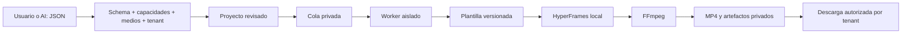

# CITAYA VIDEO STUDIO — arquitectura v1

## Lo que existe

Motor local funcional, contrato JSON Schema estricto, catálogo de verdad, siete presets de plantilla basados en V2, procesamiento local de medios/voz/subtítulos, previews y finales; servicio Python con SQLite privado, cola transaccional, aislamiento por tenant/proyecto, aprobación de finales, worker independiente y ledger de uso. No se ejecuta render dentro de una petición web. No existe un modelo generativo de video ni llamadas obligatorias a un LLM.

`catalog/` es mantenido por el propietario, nunca por JSON generado por AI. `schemas/` define la interfaz de contenido. `templates/*/template.json` declara renderer y escenas permitidas. `scripts/compose.py` conserva la composición, GSAP, fuente, paleta, acercamientos y cierre de V2. La CSS V2 original se conserva como referencia; el motor compartido parametriza tiempos, textos, branding y medios. Los modos de negocio externo no heredan las capturas de Agendas.

## Dos entradas

**Operador interno:** CLI local, configuración en `configs/`, medios revisados bajo `inputs/`, salida exclusiva en `outputs/`. Contexto interno fijo `00000000-0000-0000-0000-000000000001` salvo `--tenant-id` proporcionado por el operador. No es una credencial. `--mode final --approve-final` es una instrucción explícita del operador, no un campo que pueda aportar el modelo.

**Futuro autoservicio:** `backend/studio.py` es una biblioteca de servicio privada, no un servidor abierto. El adaptador Next.js deberá ejecutar los guards Citaya existentes para autenticar y resolver el tenant desde contexto confiable, y entonces construir `Actor(tenant_id, user_id)`. Nunca construirlo desde el body, una salida AI o un tenant elegido por el navegador. No se creó una ruta HTTP insegura provisional.

Los métodos del servicio crean proyectos, registran uploads ya inspeccionados, validan, encolan, aprueban finales, cancelan, reintentan y autorizan descargas. El worker se ejecuta fuera de Next.js y no recibe cookies del usuario. SQLite es la implementación de referencia para un servidor; PostgreSQL y almacenamiento privado son adaptadores futuros. No se modifica ni aplica una migración a la base actual de Citaya.

## Estados y concurrencia

Proyecto: `draft → validated → queued → rendering → completed | failed | cancelled`. Encolar también valida de manera atómica antes de pasar a queued. Editar un proyecto inactivo incrementa revision y vuelve a draft. Sólo un trabajo activo por proyecto.

Trabajo: `queued → rendering → completed | failed | cancelled`. Sólo failed puede volver a queued conservando su ID y clave de idempotencia. Una petición repetida con la misma clave devuelve el trabajo existente; reutilizarla con otra configuración falla. Cancelled no se reactiva. Los trabajos completados no se vuelven a cobrar.

`BEGIN IMMEDIATE` serializa los claims en SQLite. Cada intento obtiene un lease_token nuevo y un número de intento. Publicar exige estado rendering, token vigente y lease sin expirar. Un worker antiguo no puede publicar después de cancelación o retry. Lease inicial de 30 minutos, timeout del proceso de 25 minutos; existe heartbeat para integraciones de mayor duración. Al expirar el lease el trabajo falla cerrado y requiere retry explícito. La cancelación impide publicar pero puede consumir CPU hasta que el proceso termine; ese consumo se registra.

La aprobación guarda usuario, preview completado, revision y fingerprint de configuración/catálogo/plantillas/scripts. Un final sólo se encola si existe una aprobación vigente no consumida. Cambiar contenido o motor exige nueva previsualización y aprobación. No se encola final por una sugerencia AI.

## Añadir nodos

Hoy: varios procesos `backend/worker.py --node nombre` en el mismo host, con el mismo SQLite y volumen privado. Cada proceso ejecuta un render a la vez. No compartir SQLite mediante NFS entre hosts. Para varios servidores, sustituir claim por PostgreSQL `FOR UPDATE SKIP LOCKED`, conservar fencing/idempotencia y usar un bucket privado. El worker y contrato JSON no cambian. No hace falta Kubernetes.

## Formatos

MODES contiene canvas, fps y calidad. La composición usa un escenario lógico 1080×1920 escalado a 720×1280 para preview. Final conserva 1080×1920. Square y landscape necesitan presets de disposición probados en el mismo motor; actualmente se rechazan, no se estira un vertical incorrectamente.

## Extensión

Nuevo producto: entrada en products + capacidades con evidencia. Nuevo nicho: entrada en niches, sin cambiar animaciones. Nueva plantilla: metadata versionada + renderer existente y escenas permitidas; actualizar catalog/templates y allowedTemplates. Un cambio incompatible crea versión nueva, no modifica silenciosamente v1. Las plantillas futuras pueden reutilizar las funciones de entrada, acercamiento y cierre.

El ejemplo de unidad systemd en `ops/` propone usuario dedicado, filesystem protegido y PrivateNetwork (loopback disponible para Chromium). Es una guía de despliegue no ejecutada; la suite local prueba la lógica de aislamiento, no una sandbox desplegada.
