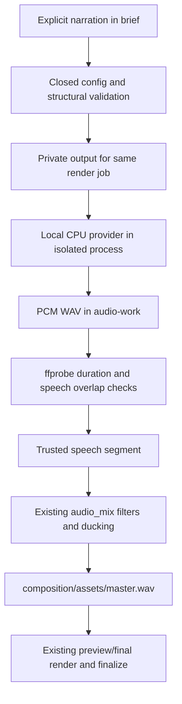

# CIT-128 — local narration pipeline

Base: `e7ea49d428c9a958b42cbc3a808404fc3be19cb5`. No renderer, Qwen model/prompt, deployment or production changes.

## Contract and flow

```json
{
  "audio": {
    "music": true,
    "sfx": true,
    "duckMusicDuringVoice": true,
    "tts": {
      "enabled": true,
      "text": "Conoce nuestro trabajo. Reserva tu hora.",
      "voice": "es-male-1",
      "speed": 1.0,
      "start": 0
    }
  }
}
```

Both schemas close the object to these fields. Server validation requires nonempty plain text, at most 1200 characters, without HTML/SSML, URLs, paths, controls, credential patterns or command/instruction markers. It preserves Spanish and punctuation. Arbitrary prose cannot be classified exhaustively by regular expressions: the security boundary is that text is only phonetic input, never executed or interpreted by a language model. Piper raw-phoneme delimiters are also rejected.

`voice` defaults to the code-owned `es-male-1`; `speed` defaults to 1.0 and is restricted to 0.90–1.10; `start` defaults to 0 and must precede the end of the timeline. Model, executable, speaker, URL, seed and style prompts are not accepted. Disabled/absent TTS preserves legacy audio behavior.



Structural validation reports `ttsValidation: pending-synthesis`; it cannot certify unknown audio duration. Generation measures actual PCM/ffprobe duration, then reports `measured`. TTS exceeding the timeline fails with `TTS_DURATION_EXCEEDS_VIDEO`; tolerance is only 1/48000 second for rounding. No truncation, automatic speed change, scene changes or video extension. Recorded client/creator voiceover aliases conflict with TTS (`TTS_VOICE_CONFLICT`). Creator clip audio still follows the existing overlap rule and mute option.

## Brief extraction

`tts_contract.extract_narration` recognizes line-anchored `LOCUCIÓN:`, `LOCUCION:`, `NARRACIÓN:`, `NARRACION:` and `VOICEOVER:`, including optional Markdown headings. It stops at the next uppercase structural header, a known section header (case-insensitive), a Markdown heading or EOF. Duplicate narration blocks and invalid/empty blocks fail. Optional exterior quotes are removed and line breaks become spaces; copy is otherwise unchanged. `VOZ:` is a style section, never narration.

Tenant creation and the Director apply this deterministic extraction outside Qwen's response. Existing explicit TTS speed/start survive direction. Without a block, creation does not enable TTS and edits preserve an already explicit config. The internal brief CLI supports the same extraction. No Qwen prompts, model choices or visual-selection semantics changed.

## Provider and privacy

`tts_provider.TTSProvider.synthesize(text, voice, speed, output_path)` returns provider/model/alias, measured duration, sample rate and inference time. `LocalTTSProvider` uses only operator-installed Piper and a pinned model hash under `/home/verf/apps/citaya-tts-runtime/`. Missing runtime fails with `TTS_DEPENDENCY_MISSING`; there is no download or cloud fallback. The real runtime has not been installed or tested yet; see [the installation proposal](local-tts-runtime-proposal.md).

The Python child uses `-I`, a minimal environment without application secrets, stdin for text, CPU inference and Linux libseccomp to deny networking before importing Piper/ONNX. Native socket creation is tested to return EPERM. No HTTP server, service, browser, shell invocation or persistent TTS queue is involved. Failure to establish the network guard fails closed.

Narration is reserved as `<job>/audio-work/narration.wav` with 0600 permissions; the work directory is 0700. Symlinks, hardlinked generated files, malformed/truncated/silent WAVs and unsafe provider metadata fail validation. No shared tenant cache exists. Fake provider injection is Python-only and resides in tests; there is no fake/provider selector in CLI or tenant config.

`audio-metadata.json` adds `voiceProvider`, `voiceModel`, `voiceAlias`, `voiceGenerated`, measured duration/sample rate, inference seconds, speed, optional RSS and `voiceTextSha256`. It includes no narration text or internal paths. The private normalized config necessarily retains the original narration. Worker failures expose only bounded codes; no successful silent render is produced on synthesis failure.

## Existing mixer preserved

Generated audio enters the same speech list as recorded audio. Recorded segments retain their existing offsets/trims; generated narration is read whole after the duration gate. The filters remain highpass 80 Hz, voice loudnorm I=-16/TP=-2/LRA=7, music I=-20/TP=-2/LRA=9, spectral carve 250–3200 Hz, ducking releases 650/700 ms, existing SFX and final limiter. Output remains 48 kHz stereo `master.wav`. Missing prepared TTS is an error even when calling the mixer directly.

The worker synthesizes within its existing render job and retains measured validation metadata. Preview/final continue to consume the same master asset and retain the existing H.264/AAC export settings. Final-render approval rules are unchanged.

## Verification

Run from the repository root with the existing Python/FFmpeg/HyperFrames dependencies:

```bash
python3 -m unittest discover -s video-production/tests -p 'test_tts*.py' -v
python3 -m unittest discover -s video-production/tests -v
python3 video-production/tests/preview_tts_fake.py
```

The test harness uses a deterministic audible tone with pauses, not synthetic Spanish speech. It proves the audio/timeline pipeline, not voice naturalness. It reuses the existing modern fixture and produces ignored private output; no WAV/model is committed.

Coverage maps to the requested cases:

| Cases | Evidence |
| --- | --- |
| Config 1–10, security 27–30 | `test_tts_provider.ContractTests`, provider privacy/process tests; both schema validators |
| Conflicts 11–14 | Three recorded aliases, audible/muted creator intro, overlap boundary |
| Brief 15–22 | `NarrationTests`, tenant creation/Director tests, internal brief CLI test |
| Provider 23–30 | Real measured fake WAV, unsupported voice, bounded failures, missing runtime, symlinks, native network denial |
| Timeline 31–36 | Start zero/nonzero, exact fit, overlong/lying duration, unchanged config/speed, failure before compile/mix |
| Mix 37–45 | Real FFmpeg filtering, ducking required, music recovery during pause measured by frequency projection, SFX, 48 kHz stereo and safe metadata |
| Regression 46–50 | Recorded trim retained; disabled/absent TTS identical PCM/metadata/HTML; existing renderer tests; actual H.264/AAC fake preview; final geometry tests and unchanged export settings |

Full suite at implementation: 303 tests, 302 pass and one pre-existing failure, `test_brief.BriefTests.test_duration_not_silently_defaulted_and_readability_gate`. That failure was independently reproduced using `git archive e7ea49d428c9a958b42cbc3a808404fc3be19cb5` in a temporary directory. A subsequent bounded output-I/O test brings TTS-focused coverage to 39 tests; all pass. No existing test was relaxed or skipped.

Verified local preview: `outputs/20261008T124543.351588Z-custom-client-video-preview-d0f4da/final.mp4`: 10 seconds, 720×1280, 24 fps, H.264/AAC stereo; full decode passes. Generated WAV: 6 seconds, 24 kHz mono; master: 10 seconds, PCM16 48 kHz stereo. Metadata confirms start 0, ducking, spectral carve and SFX. Logs and outputs stay local/ignored. Modern/v1/SaaS/website rendering source and templates are unchanged.

The same output contains inspected `inspect-initial.jpg` (0 s), `inspect-middle.jpg` (5 s) and `inspect-final.jpg` (9.5 s). Inspection confirms fullscreen fixture backgrounds, legible text overlays, small branding and CTA over the final background, with no new media cards. The media itself is the existing synthetic test fixture, not photography of a real business. This inspection establishes fixture layout compatibility only.

## Limitations

- Real engine installation, voice audition, measured startup/RSS and the private reference narration benchmark await explicit owner approval.
- The selected voice's perceived age, masculine character, accent and naturalness require listening; FakeTTSProvider cannot establish them.
- No new final-mode TTS render was requested: the actual artifact is a preview; final codec/resolution compatibility is covered by existing implementation/tests.
- Text validation is deliberately conservative; narration should spell out web addresses and avoid code-like strings rather than embedding them.
- The unrelated baseline readability test still fails and is recorded above.
